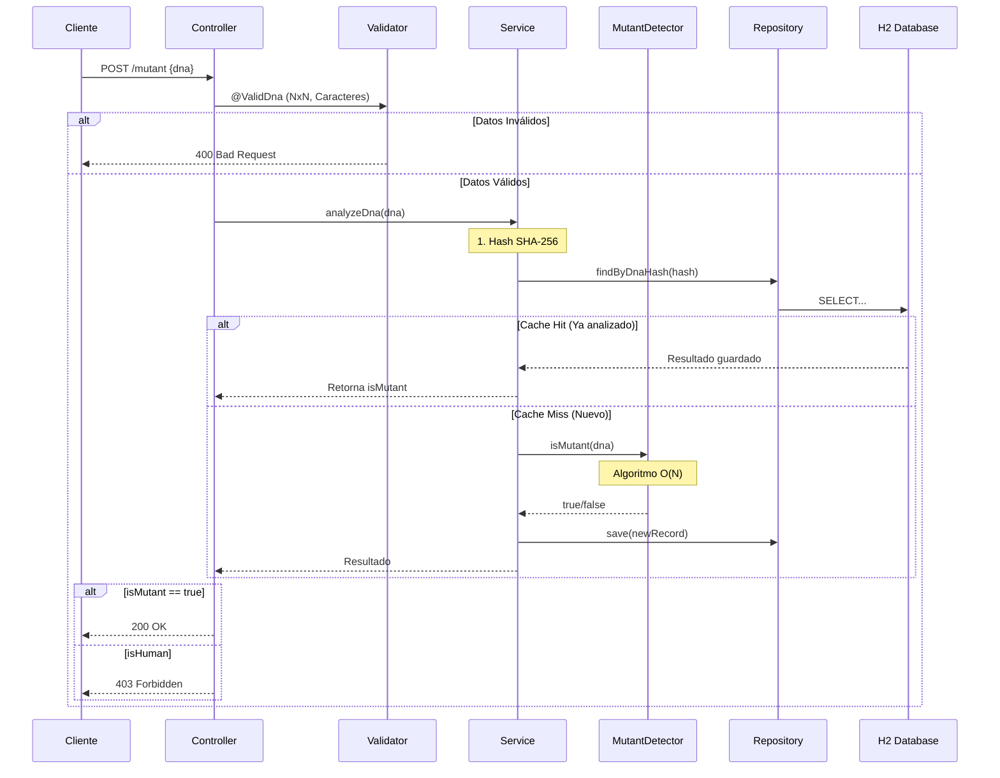

# 🧬 Mutant Detector API - Documentación Técnica Completa

**Autor:** Franco D'Agostino  
**Legajo:** 47761  
**Comisión:** 3K9  
**Materia:** Desarrollo de Software | UTN Facultad Regional Mendoza


---

## 📋 Tabla de Contenidos

1. [Introducción y Contexto](#-introducción-y-contexto)  
2. [Demo Online](#-demo-online)  
3. [Arquitectura del Sistema](#-arquitectura-del-sistema)  
4. [Tecnologías y Herramientas](#-tecnologías-y-herramientas)  
5. [Estructura del Proyecto](#-estructura-del-proyecto)  
6. [El Algoritmo de Detección](#-el-algoritmo-de-detección)  
7. [Base de Datos y Optimización](#-base-de-datos-y-optimizaci%C3%B3n)  
8. [Documentación de la API (Endpoints)](#-documentaci%C3%B3n-de-la-api-endpoints)  
9. [Testing y Calidad](#-testing-y-calidad)  
10. [Instalación y Ejecución](#-instalaci%C3%B3n-y-ejecuci%C3%B3n)  
11. [Conceptos Clave Aplicados](#-conceptos-clave-aplicados)

---

## 🎯 Introducción y Contexto

Magneto quiere reclutar la mayor cantidad de mutantes posible para luchar contra los X-Men. Te ha contratado para crear un sistema que detecte automáticamente si un humano es mutante o no, basándose en su secuencia de ADN.

Este proyecto es una **API REST de alto rendimiento** diseñada para procesar matrices de ADN, buscar patrones complejos y soportar cargas elevadas de tráfico mediante estrategias de caché y optimización algorítmica.

**El desafío técnico:**
- Detectar secuencias de 4 letras iguales (`AAAA`, `TTTT`, `CCCC`, `GGGG`).
- Buscar en direcciones **Horizontal**, **Vertical** y **Diagonales**.
- Determinar si un sujeto es mutante si se encuentran **más de una secuencia**.

---

## ☁️ Demo Online

La aplicación se encuentra desplegada en la infraestructura de **Render** y está lista para recibir peticiones públicas.

| Recurso | Enlace de Acceso |
| :--- | :--- |
| **Swagger UI** | [**Ver Documentación Interactiva**](https://mutant-detector-api-1q1n.onrender.com/swagger-ui.html) |
| **URL Base** | `https://mutant-detector-api-1q1n.onrender.com` |
| **Repositorio** | [github.com/FrankDagos/mutant-detector](https://github.com/FrankDagos/mutant-detector) |

> ⚠️ **Nota:** Al estar alojado en un servicio gratuito, la primera petición tras un periodo de inactividad puede demorar hasta **60 segundos** en "despertar" el servidor (Cold Start).

---

## 🏗 Arquitectura del Sistema

El proyecto sigue una arquitectura limpia en **6 capas**, respetando los principios SOLID y separando responsabilidades.

### Diagrama de Flujo (Sequence Diagram)



### Descripción de Capas

- **Controller Layer (MutantController):** Maneja las peticiones HTTP, códigos de respuesta y la comunicación con el cliente.  
- **DTO Layer (DnaRequest):** Objetos de transferencia de datos con validaciones (`@Valid`).  
- **Service Layer (MutantService):** Orquestador. Decide si usar el caché de la base de datos o invocar al algoritmo de detección.  
- **Core Layer (MutantDetector):** Contiene la lógica algorítmica pura para recorrer matrices.  
- **Repository Layer (DnaRecordRepository):** Abstracción de acceso a datos usando Spring Data JPA.  
- **Entity Layer (DnaRecord):** Representación de la tabla en la base de datos.

---

## 🛠 Tecnologías y Herramientas

| Tecnología | Versión / Uso Principal |
|---|---|
| Java | 17 LTS |
| Spring Boot | 3.4.x (Framework backend para REST API y DI) |
| H2 Database | 2.x (Base de datos en memoria para desarrollo/testing) |
| Hibernate / JPA | 6.x (ORM) |
| Lombok | 1.18 (Reducción de boilerplate) |
| JUnit 5 | 5.x (Testing unitario) |
| Mockito | 5.x (Mocking) |
| OpenAPI / Swagger | 3.0 (Documentación) |
| Docker | Latest (Contenerización) |
| Jacoco | (Cobertura de tests) |

---

## 📂 Estructura del Proyecto

```
src/main/java/org/example/mutant_detector/
├── config/           # Configuraciones (Swagger, Beans)
├── controller/       # Endpoints REST (@RestController)
├── dto/              # Request/Response objects (@Data)
├── entity/           # Entidades JPA (@Entity)
├── exception/        # Manejo global de errores (@ControllerAdvice)
├── repository/       # Interfaces de BD (JpaRepository)
├── service/          # Lógica de negocio (@Service)
└── validation/       # Validadores personalizados (@Constraint)
```

---

## 🧮 El Algoritmo de Detección

El corazón del sistema es la clase `MutantDetector`. Se priorizó la eficiencia (Tiempo y Espacio) sobre la simplicidad.

### Lógica de Recorrido

Se recorre la matriz una única vez (i, j). Desde cada celda, se dispara la búsqueda en 4 direcciones si hay espacio suficiente:

- **Horizontal:** (i, j) -> (i, j+3)  
- **Vertical:** (i, j) -> (i+3, j)  
- **Diagonal Principal:** (i, j) -> (i+3, j+3)  
- **Diagonal Inversa:** (i, j) -> (i+3, j-3)

### Optimizaciones Clave

1. **Early Termination (Corte Temprano)**  
   El requerimiento pide detectar más de una secuencia.  
   ```java
   if (sequenceCount > 1) return true; // Detiene el proceso INMEDIATAMENTE
   ```
   Esto significa que si se encuentran dos secuencias en las primeras filas, el resto de la matriz (que podría ser de 1000x1000) se ignora por completo, ahorrando milisegundos valiosos de CPU.

2. **Matriz de Caracteres (`char[][]`)**  
   Spring recibe un JSON con Array de Strings. Convertimos esto inmediatamente a una matriz primitiva de `char`.  
   Por qué: El acceso a `matrix[row][col]` es mucho más rápido en bajo nivel que `stringArray[row].charAt(col)`, evitando overhead de objetos `String` en bucles intensivos.

3. **Recorridos condicionados por límites**  
   Antes de iniciar la búsqueda en una dirección, verificamos que haya espacio suficiente para una secuencia de 4 caracteres, evitando accesos fuera de rango.

---

## 💾 Base de Datos y Optimización

### Esquema de Datos

**Tabla:** `dna_records`

| Columna | Tipo | Índice / Observaciones |
|---|---:|---|
| id | BIGINT (PK, Auto-inc) | Identificador interno |
| dna_hash | VARCHAR | UNIQUE (Hash SHA-256 del ADN completo) |
| is_mutant | BOOLEAN | Indexado |
| created_at | TIMESTAMP | Fecha de análisis |

### Estrategia de "Fingerprinting" (SHA-256)

Guardar el ADN completo (String gigante) es ineficiente.  
Solución: Calculamos el Hash SHA-256 del ADN entrante.  
Beneficio: Convertimos un ADN de cualquier tamaño en una cadena fija de 64 caracteres.  

**Caché Persistente:** Antes de analizar, buscamos el Hash en la BD. Si existe, devolvemos el resultado guardado (O(1)). Esto hace que analizar el mismo ADN un millón de veces solo cueste CPU la primera vez.

---

## 📡 Documentación de la API (Endpoints)

### 1. Detectar Mutante
**POST** `/mutant`  
Envía una secuencia de ADN para su análisis.

**Body (JSON)**
```json
{
  "dna": ["ATGCGA","CAGTGC","TTATGT","AGAAGG","CCCCTA","TCACTG"]
}
```

**Respuestas**
- `200 OK` — Es Mutante.
- `403 Forbidden` — Es Humano.
- `400 Bad Request` — Matriz inválida, caracteres extraños o tamaño excedido.

---

### 2. Estadísticas (Nivel 2 y 3)
**GET** `/stats`  
Obtiene el reporte global de verificaciones.

**Parámetros opcionales**
- `startDate=YYYY-MM-DD`
- `endDate=YYYY-MM-DD`

**Respuesta (JSON)**
```json
{
  "count_mutant_dna": 40,
  "count_human_dna": 100,
  "ratio": 0.4
}
```

---

### 3. Gestión de Registros (Nivel 2)
**DELETE** `/mutant/{hash}`  
Elimina un registro específico por su Hash para mantenimiento.

---

### 4. Health Check (Nivel 1)
**GET** `/health`  
Endpoint ligero para balanceadores de carga. Retorna:
```json
{"status": "UP"}
```

---

## 🧪 Testing y Calidad

El proyecto no solo funciona, sino que está probado exhaustivamente.

**Métricas de Calidad**
- Cobertura Total: **90%** (Superando el requisito de 80%).  
- Tests Unitarios: **27** pruebas.  
- Tests de Integración: **10** pruebas.  
- Total Tests: **37** pruebas automatizadas.

**Ejecución de Tests**
Para correr la suite completa y generar el reporte visual de cobertura:

```bash
./gradlew clean test jacocoTestReport
```

El reporte HTML estará disponible en: `build/reports/jacoco/test/html/index.html`

---

## 🚀 Instalación y Ejecución

### Opción A: Ejecución Local

**Clonar**
```bash
git clone https://github.com/FrankDagos/mutant-detector.git
cd mutant-detector
```

**Compilar y Correr**
```bash
./gradlew bootRun
```

**Probar**
- API Local: `http://localhost:8080`
- H2 Console: `http://localhost:8080/h2-console`

---

### Opción B: Ejecución con Docker

El proyecto incluye un Dockerfile optimizado (Multi-Stage Build).

**Construir imagen**
```bash
docker build -t mutant-api .
```

**Ejecutar contenedor**
```bash
docker run -p 8080:8080 mutant-api
```

---

## 🎓 Conceptos Clave Aplicados

Durante el desarrollo de este proyecto se aplicaron los siguientes conceptos avanzados:

- **Dependency Injection:** Uso de Spring para gestionar el ciclo de vida de los componentes.  
- **Fail-Fast Validation:** Validaciones en capa DTO para rechazar peticiones inválidas antes de que consuman recursos del servidor.  
- **In-Memory Database:** Uso de H2 para desarrollo rápido y testing aislado.  
- **Hashing & Indexing:** Uso de índices SQL y SHA-256 para búsquedas de alto rendimiento.  
- **Logging & Monitoring:** Implementación de trazas con SLF4J para depuración en producción.

---

⭐ **Proyecto desarrollado para la cátedra de Desarrollo de Software - UTN FRM**
